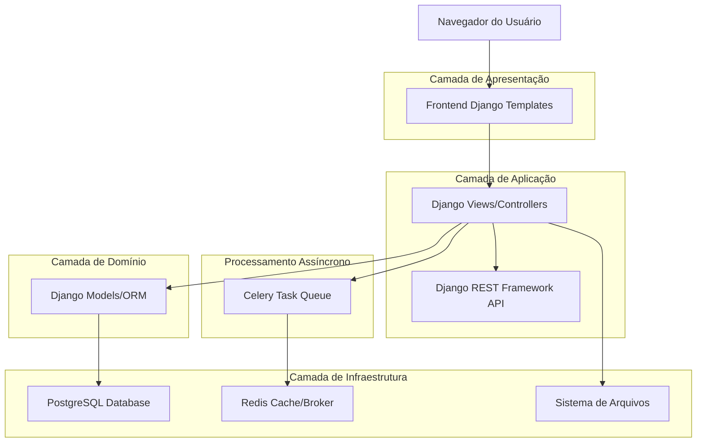
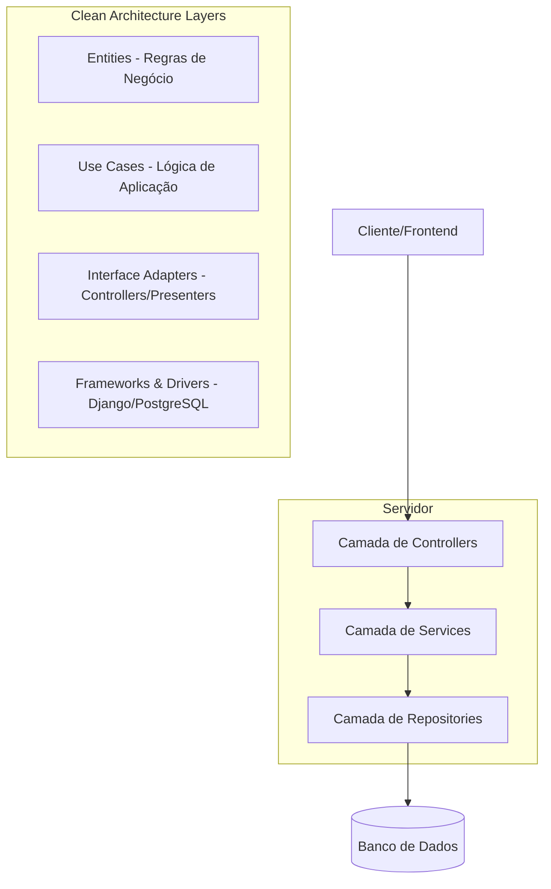
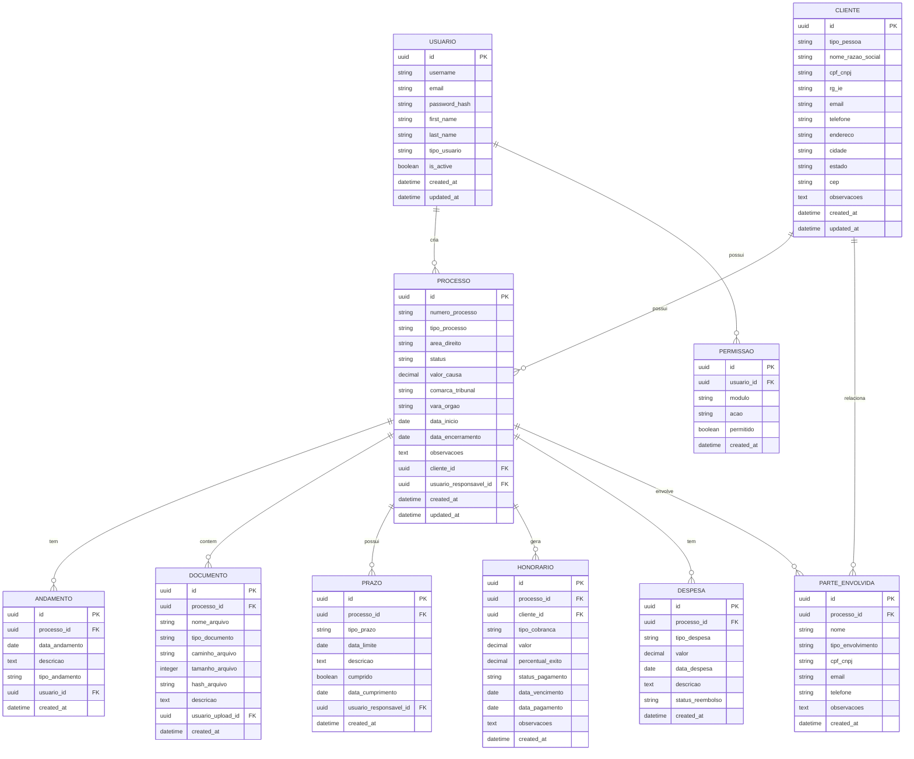

# Documentação de Arquitetura Técnica - Plataforma Jurídica

## 1. Design da Arquitetura



## 2. Descrição das Tecnologias

* **Backend**: Django 4.2+ com Python 3.11+

* **Banco de Dados**: PostgreSQL 15+ (produção), SQLite (desenvolvimento)

* **API**: Django REST Framework 3.14+

* **Cache/Broker**: Redis 7.0+

* **Task Queue**: Celery 5.3+

* **Frontend**: Django Templates + Bootstrap 5 + JavaScript ES6+

* **Autenticação**: Django Authentication System

* **Armazenamento**: Sistema de arquivos local (desenvolvimento), AWS S3 (produção)

## 3. Definições de Rotas

| Rota                          | Propósito                                  |
| ----------------------------- | ------------------------------------------ |
| `/`                           | Dashboard principal com KPIs e visão geral |
| `/login/`                     | Página de autenticação de usuários         |
| `/logout/`                    | Logout e redirecionamento                  |
| `/dashboard/`                 | Dashboard principal pós-login              |
| `/processos/`                 | Lista de processos com filtros             |
| `/processos/novo/`            | Formulário de cadastro de novo processo    |
| `/processos/<id>/`            | Detalhes de processo específico            |
| `/processos/<id>/andamentos/` | Andamentos de um processo                  |
| `/processos/<id>/documentos/` | Documentos de um processo                  |
| `/clientes/`                  | Lista de clientes                          |
| `/clientes/novo/`             | Cadastro de novo cliente                   |
| `/clientes/<id>/`             | Perfil detalhado do cliente                |
| `/financeiro/`                | Dashboard financeiro                       |
| `/financeiro/honorarios/`     | Gestão de honorários                       |
| `/financeiro/despesas/`       | Controle de despesas                       |
| `/relatorios/`                | Centro de relatórios                       |
| `/configuracoes/`             | Configurações do sistema                   |
| `/api/v1/`                    | Base da API REST                           |

## 4. Definições da API

### 4.1 API Principal

**Autenticação de usuários**

```
POST /api/v1/auth/login/
```

Request:

| Parâmetro | Tipo   | Obrigatório | Descrição                |
| --------- | ------ | ----------- | ------------------------ |
| username  | string | true        | Nome de usuário ou email |
| password  | string | true        | Senha do usuário         |

Response:

| Parâmetro   | Tipo   | Descrição                 |
| ----------- | ------ | ------------------------- |
| token       | string | Token de autenticação JWT |
| user        | object | Dados básicos do usuário  |
| permissions | array  | Lista de permissões       |

Exemplo:

```json
{
  "username": "advogado@escritorio.com",
  "password": "senha123"
}
```

**Gestão de Processos**

```
GET /api/v1/processos/
POST /api/v1/processos/
GET /api/v1/processos/{id}/
PUT /api/v1/processos/{id}/
DELETE /api/v1/processos/{id}/
```

**Gestão de Clientes**

```
GET /api/v1/clientes/
POST /api/v1/clientes/
GET /api/v1/clientes/{id}/
PUT /api/v1/clientes/{id}/
```

**Andamentos Processuais**

```
GET /api/v1/processos/{id}/andamentos/
POST /api/v1/processos/{id}/andamentos/
```

**Upload de Documentos**

```
POST /api/v1/processos/{id}/documentos/
```

Request:

| Parâmetro | Tipo   | Obrigatório | Descrição              |
| --------- | ------ | ----------- | ---------------------- |
| arquivo   | file   | true        | Arquivo a ser enviado  |
| tipo      | string | true        | Tipo do documento      |
| descricao | string | false       | Descrição do documento |

## 5. Arquitetura do Servidor



## 6. Modelo de Dados

### 6.1 Definição do Modelo de Dados



### 6.2 Linguagem de Definição de Dados (DDL)

**Tabela de Usuários**

```sql
-- Criar tabela de usuários
CREATE TABLE usuarios (
    id UUID PRIMARY KEY DEFAULT gen_random_uuid(),
    username VARCHAR(150) UNIQUE NOT NULL,
    email VARCHAR(254) UNIQUE NOT NULL,
    password_hash VARCHAR(128) NOT NULL,
    first_name VARCHAR(150) NOT NULL,
    last_name VARCHAR(150) NOT NULL,
    tipo_usuario VARCHAR(20) DEFAULT 'advogado' CHECK (tipo_usuario IN ('administrador', 'advogado', 'estagiario', 'cliente')),
    is_active BOOLEAN DEFAULT TRUE,
    created_at TIMESTAMP WITH TIME ZONE DEFAULT NOW(),
    updated_at TIMESTAMP WITH TIME ZONE DEFAULT NOW()
);

-- Criar tabela de clientes
CREATE TABLE clientes (
    id UUID PRIMARY KEY DEFAULT gen_random_uuid(),
    tipo_pessoa VARCHAR(2) NOT NULL CHECK (tipo_pessoa IN ('PF', 'PJ')),
    nome_razao_social VARCHAR(255) NOT NULL,
    cpf_cnpj VARCHAR(18) UNIQUE NOT NULL,
    rg_ie VARCHAR(20),
    email VARCHAR(254),
    telefone VARCHAR(20),
    endereco TEXT,
    cidade VARCHAR(100),
    estado VARCHAR(2),
    cep VARCHAR(10),
    observacoes TEXT,
    created_at TIMESTAMP WITH TIME ZONE DEFAULT NOW(),
    updated_at TIMESTAMP WITH TIME ZONE DEFAULT NOW()
);

-- Criar tabela de processos
CREATE TABLE processos (
    id UUID PRIMARY KEY DEFAULT gen_random_uuid(),
    numero_processo VARCHAR(50) UNIQUE NOT NULL,
    tipo_processo VARCHAR(50) NOT NULL,
    area_direito VARCHAR(100) NOT NULL,
    status VARCHAR(20) DEFAULT 'ativo' CHECK (status IN ('ativo', 'suspenso', 'encerrado')),
    valor_causa DECIMAL(15,2),
    comarca_tribunal VARCHAR(200),
    vara_orgao VARCHAR(200),
    data_inicio DATE NOT NULL,
    data_encerramento DATE,
    observacoes TEXT,
    cliente_id UUID NOT NULL REFERENCES clientes(id),
    usuario_responsavel_id UUID NOT NULL REFERENCES usuarios(id),
    created_at TIMESTAMP WITH TIME ZONE DEFAULT NOW(),
    updated_at TIMESTAMP WITH TIME ZONE DEFAULT NOW()
);

-- Criar índices para otimização
CREATE INDEX idx_processos_cliente_id ON processos(cliente_id);
CREATE INDEX idx_processos_usuario_responsavel ON processos(usuario_responsavel_id);
CREATE INDEX idx_processos_status ON processos(status);
CREATE INDEX idx_processos_data_inicio ON processos(data_inicio DESC);

-- Dados iniciais
INSERT INTO usuarios (username, email, password_hash, first_name, last_name, tipo_usuario)
VALUES 
    ('admin', 'admin@plataformajuridica.com', 'pbkdf2_sha256$hash', 'Administrador', 'Sistema', 'administrador'),
    ('advogado1', 'advogado@escritorio.com', 'pbkdf2_sha256$hash', 'João', 'Silva', 'advogado');
```

