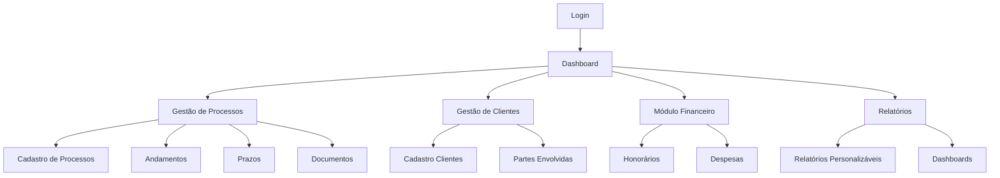

# Documento de Requisitos do Produto - Plataforma de Gestão de Processos Jurídicos

## 1. Visão Geral do Produto

Plataforma completa de gestão de processos jurídicos desenvolvida para escritórios de advocacia, oferecendo controle total sobre processos, clientes, prazos, documentos e aspectos financeiros. A solução visa otimizar a produtividade jurídica através de automação, organização e relatórios inteligentes.

O sistema resolve problemas críticos como perda de prazos, desorganização documental e falta de controle financeiro, sendo utilizado por advogados, estagiários e administradores. A plataforma tem potencial para capturar significativa fatia do mercado jurídico brasileiro, estimado em bilhões de reais.

## 2. Funcionalidades Principais

### 2.1 Papéis de Usuário

| Papel | Método de Registro | Permissões Principais |
|-------|-------------------|----------------------|
| Administrador | Criação direta no sistema | Acesso total, configurações, gestão de usuários |
| Advogado | Convite por administrador | Gestão completa de processos e clientes |
| Estagiário | Convite por advogado/admin | Visualização e edição limitada de processos |
| Cliente | Portal de autoatendimento | Visualização de seus processos e documentos |

### 2.2 Módulos Funcionais

Nossa plataforma jurídica consiste nas seguintes páginas principais:

1. **Dashboard Principal**: visão geral de KPIs, prazos críticos, processos ativos, gráficos de desempenho
2. **Gestão de Processos**: cadastro completo, andamentos cronológicos, controle de prazos, upload de documentos
3. **Gestão de Clientes**: cadastro PF/PJ, histórico de interações, CRM básico, documentos do cliente
4. **Módulo Financeiro**: controle de honorários, despesas processuais, relatórios financeiros
5. **Relatórios e Analytics**: relatórios personalizáveis, dashboards interativos, exportação de dados
6. **Configurações do Sistema**: tipos de processo, áreas do direito, modelos de documentos, permissões
7. **Portal do Cliente**: acesso restrito para clientes visualizarem seus processos

### 2.3 Detalhes das Páginas

| Página | Módulo | Descrição da Funcionalidade |
|--------|--------|-----------------------------|
| Dashboard Principal | Visão Geral | Exibir KPIs principais, prazos críticos próximos, gráficos de processos por status, alertas importantes |
| Gestão de Processos | Cadastro de Processos | Registrar novos processos com número, tipo, área do direito, partes envolvidas, valor da causa |
| Gestão de Processos | Andamentos | Registrar cronologicamente todos os andamentos com data, descrição, responsável e anexos |
| Gestão de Processos | Controle de Prazos | Gerenciar prazos processuais com alertas automáticos, calendário integrado, notificações |
| Gestão de Processos | Documentos | Upload seguro de documentos, controle de versão, organização por categorias |
| Gestão de Clientes | Cadastro de Clientes | Registrar dados completos PF/PJ, contatos, endereços, documentos, histórico |
| Gestão de Clientes | Partes Envolvidas | Cadastrar advogados contrários, réus, testemunhas, peritos com dados específicos |
| Módulo Financeiro | Honorários | Controlar diferentes tipos de cobrança (fixo, êxito, hora), valores, parcelas |
| Módulo Financeiro | Despesas | Lançar custas processuais, taxas, viagens, outras despesas por processo |
| Relatórios | Relatórios Personalizáveis | Gerar relatórios filtráveis sobre processos, clientes, financeiro com exportação PDF/Excel |
| Relatórios | Dashboards Interativos | Visualizar gráficos de KPIs, produtividade, prazos críticos, análise de carteira |
| Configurações | Configurações Gerais | Personalizar tipos de processo, áreas do direito, status, parâmetros do sistema |
| Configurações | Modelos de Documentos | Criar e gerenciar templates de petições, contratos, outros documentos |
| Portal Cliente | Acesso Restrito | Permitir que clientes visualizem seus processos, documentos e andamentos |

## 3. Fluxo Principal de Processos

**Fluxo do Advogado:**
1. Login no sistema → Dashboard com visão geral
2. Cadastrar novo cliente → Registrar dados completos
3. Criar novo processo → Vincular cliente e partes
4. Registrar andamentos → Acompanhar cronologicamente
5. Controlar prazos → Receber alertas automáticos
6. Gerenciar documentos → Upload e organização
7. Lançar honorários/despesas → Controle financeiro
8. Gerar relatórios → Análise de desempenho

**Fluxo do Cliente:**
1. Acesso ao portal → Login restrito
2. Visualizar processos → Status e andamentos
3. Consultar documentos → Downloads permitidos
4. Acompanhar prazos → Próximas datas importantes

## 4. Design da Interface

### 4.1 Estilo de Design

- **Cores Primárias**: Azul profissional (#1e3a8a), Cinza corporativo (#64748b)
- **Cores Secundárias**: Verde sucesso (#059669), Vermelho alerta (#dc2626), Amarelo atenção (#d97706)
- **Estilo de Botões**: Arredondados com sombra sutil, efeito hover suave
- **Tipografia**: Inter ou Roboto, tamanhos 14px (corpo), 16px (títulos), 12px (legendas)
- **Layout**: Design limpo baseado em cards, navegação lateral fixa, breadcrumbs
- **Ícones**: Heroicons ou Feather icons para consistência visual

### 4.2 Visão Geral das Páginas

| Página | Módulo | Elementos de UI |
|--------|--------|----------------|
| Dashboard | Visão Geral | Cards de KPIs com ícones, gráficos coloridos, lista de prazos críticos, barra lateral de navegação |
| Processos | Cadastro | Formulário em etapas, campos obrigatórios destacados, validação em tempo real, botões de ação claros |
| Clientes | Gestão | Tabela responsiva com filtros, modal de edição, cards de informações, histórico em timeline |
| Financeiro | Controle | Gráficos de receitas/despesas, tabelas com totalizadores, filtros por período, exportação |
| Relatórios | Analytics | Interface de filtros avançados, visualizações gráficas interativas, botões de exportação |
| Configurações | Sistema | Abas organizadas, formulários de configuração, toggles para ativação/desativação |

### 4.3 Responsividade

A plataforma é desktop-first com adaptação mobile completa. Interface otimizada para tablets e smartphones com navegação touch-friendly, menus colapsáveis e layouts flexíveis que se adaptam a diferentes tamanhos de tela.
